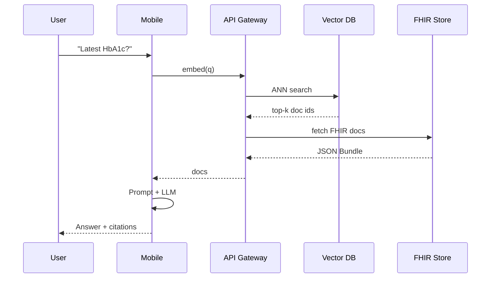

# Mobile FHIR-RAG Chat – MVP Design

## 1. Objective
Deliver a HIPAA-ready mobile chat that lets clinicians query patient-specific
FHIR data via an *on-device* LLM with *cloud-based* retrieval-augmented
generation (RAG).

## 2. Scope (MVP)
✔ Single-patient context per session  
✔ Read-only FHIR resources (Patient, Observation, Condition, Medication)  
✔ Clinician login (Firebase Auth)  
✖ No write-back to FHIR store (deferred)  

## 3. High-Level Architecture
```
Mobile (React Native)  <--JWT-->  API Gateway (Node)  <--REST-->  Cloud FHIR Store
         |                                   |
         |--local-tok-query/response          |--Vector DB (pgvector)
         |                                   |
         |<-----Context (K docs)--------------|
         |                                   |
    llama.cpp (quantised GGUF)         Vertex AI Embeddings
```

## 4. Component Breakdown
1. **Mobile Client**
   - React Native + TypeScript (Expo).
   - Bridges llama.cpp via native module.
   - Streams tokens to UI; abort controller for cancel.
2. **On-device LLM**
   - 7B Q4_K_M model in GGUF (<1.9 GB); fits modern iOS/Android GPU.
   - Prompt format: `[SYS] You are a clinical assistant...`
3. **Backend API Gateway**
   - Express + TypeScript deployed on Cloud Run.
   - Routes: `/fhir/*` (proxy), `/rag/search`.
4. **Vector Store**
   - Cloud SQL Postgres + pgvector (1536-dim f32).
   - HNSW index; top-k=8 in <150 ms for 1 M chunks.
5. **Embedding Pipeline**
   - Cloud Scheduler → Cloud Run job.
   - Fetch new FHIR resources → chunk (400 tokens, 50 overlap) →
     embed (Vertex AI `textembedding-gecko@003`) → upsert.
6. **Security**
   - BAA-covered GCP project.
   - At-rest: CMEK on Cloud SQL / Cloud Storage.
   - In-transit: TLS 1.3; JWT scope `patient/{id}.read`.

## 5. Data Flow
1. Clinician logs in → Firebase → JWT.
2. User types query.
3. Mobile sends embeddings(query) to `/rag/search`.
4. API returns top-k chunks + metadata.
5. Mobile assembles prompt (`question + context`) → llama.cpp → answer.
6. Display answer; offer “view cited resource” links.

## 6. Sequence Diagram – Chat


## 7. Error Handling
| Stage | Error | Mitigation |
|-------|-------|------------|
| Auth  | Token expired | Refresh silently; fallback to login |
| Search | ANN timeout | Return “insufficient context”, still answer via LLM |
| LLM    | OOM | Switch to 4-bit quant or remote fallback |

## 8. Performance Targets
• P95 ANN search <200 ms  
• P95 on-device generation 20 tokens/s  
• Total TTI <3 s for 50-token answer  

## 9. Compliance & Logging
Audit trail stored in BigQuery (`userId, patientId, ts, promptHash`).
PHI never leaves GCP boundary except encrypted to device.

## 10. Roadmap
1. MVP (this doc)  
2. Multimodal (lab charts)  
3. Write-back order entry  
